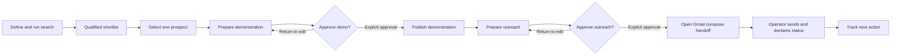

# Functional Design — Phase 2

## Document status

- Status: approved for Phase 3 handoff
- Phase: 2 — Functional Design
- Owner: Javier Napoles, founder and sole operator of HORUS
- Created: 2026-08-06
- Approval: Javier Napoles, 2026-08-06
- Scope: behavior and interface only; this document selects no implementation architecture, database, framework, or deployment mechanism.

## 1. Design objective

The operator must be able to understand, interrupt, resume, and approve one prospecting run without losing the evidence behind any conclusion.

The product is an internal, single-operator desktop application. Its interface is a workbench for judgment, not a customer-facing sales experience. It must keep three things visible at all times:

1. the current workflow state and the next permitted action;
2. the evidence and uncertainty behind a recommendation; and
3. the two approval gates that prevent publication and outreach without an explicit operator decision.

The end-to-end success path remains unchanged:

`search → qualified shortlist → selected prospect → approved live demonstration → approved outreach → tracked next action`

## 2. Functional boundaries

### In scope for this design

- The ten charter workflow steps, their states, inputs, outputs, failures, and acceptance conditions.
- The six required views: Search, Shortlist, Prospect detail, Demonstration review, Outreach review, and Tracker.
- Evidence presentation, operator decisions, resumption after an interruption, and freshness checks at approval gates.
- The content structure and review requirements for a concept demonstration website.

### Explicitly not designed here

- Application architecture, data-store choice, API-client implementation, authentication, or deployment automation.
- A production website for a prospect, a customer portal, payments, forms that collect data, or automated email sending.
- Changes to either calibrated scoring-model version or to any accepted decision.

## 3. Workflow state model

Each run and prospect has a visible state. A state is not merely a label: it determines what the operator may do next and what HORUS must block.

Only the two decision nodes lead to publication or Gmail compose handoff. HORUS has no transition, credential, or integration that sends email.

| Object | States | Required transition rule |
| --- | --- | --- |
| Search run | `draft`, `resolving_location`, `running`, `paused`, `completed_target`, `completed_ceiling`, `failed`, `cancelled` | A completed run records the stopping reason and cannot silently become a new run. |
| Candidate | `discovered`, `auto_rejected`, `insufficient_data`, `reputation_qualified`, `flagged`, `shortlisted`, `not_pursued` | An operator flag never changes a candidate to rejected by itself. |
| Prospect | `selected`, `refresh_required`, `demo_in_preparation`, `demo_awaiting_approval`, `demo_published`, `outreach_in_preparation`, `outreach_awaiting_approval`, `outreach_drafted`, `sent_declared`, `engaged`, `closed`, `follow_up_due` | One prospect is selected for a run. A later state does not erase its preceding evidence. |
| Demonstration | `draft`, `awaiting_approval`, `published`, `expired_awaiting_decision`, `removed` | Publication is impossible from any state other than `awaiting_approval` after explicit approval. |
| Outreach | `draft`, `awaiting_approval`, `gmail_handoff_opened`, `sent_declared`, `not_sent` | HORUS opens a Gmail compose handoff only after explicit approval; it never sends or holds Gmail credentials. |

The Tracker may show a prospect's current state, but its event history must retain every state change, timestamp, source-data age at the time of approval, operator decision, and decision rationale where one is required.

## 4. Ten-step functional specification

| # | Operator input / action | HORUS transformation and output | Errors or uncertainty | Step acceptance condition |
| --- | --- | --- | --- | --- |
| 1. Define search | Enter category, city, state/region, `TARGET_QUALIFIED`, and `MAX_EXAMINED`; confirm the market-boundary interpretation. | Resolve the city; display the resolved place and the selected parameters before a run is created. | Ambiguous or unresolved city; invalid limits; missing home base. Do not start. | The operator sees and confirms one resolved location and bounded search parameters. |
| 2. Discover candidates | Start the search. | Retrieve and cache candidate listings; deduplicate; apply G1/G2; show examined, surviving, rejected, and credit-progress counts. | Source failure, malformed response, duplicate ambiguity, or cancellation. Preserve completed work and show the failed unit. | Each examined listing has a recorded source snapshot and a visible initial outcome. |
| 3. Qualify and rank | Allow the run to continue, pause, or cancel. | For economical survivors, retrieve/cache review history, apply gates and `reputation-scoring-v1`, measure available web evidence under `web-opportunity-v2`, calculate proximity, then rank qualified candidates by band → web opportunity → reputation. | Partial review history, inaccessible site, unavailable measurement, or unknown distance remains visible as `partial_data`, `unmeasured`, or `insufficient_data`; none becomes a fabricated negative. | The result records its stopping limit, counts per stage, model versions, source timestamps, scores, flags, and rank rationale. |
| 4. Select prospect | Open evidence, record a flag decision if present, then select exactly one qualified prospect. | Freeze the selected prospect's current evidence as the working snapshot and create its prospect record. | A flag needs an operator decision; data may already exceed the 30-day contact limit. | The record contains selection time, rationale, all flag decisions, and the next allowed action. |
| 5. Prepare demonstration | Choose only source-backed business facts, public images, and clearly labelled placeholders; edit copy and layout. | Build a preview plus a content-evidence inventory mapping every factual element and image to its source. | Missing source, ambiguous ownership, prohibited unsupported claim, or a form configured to transmit data blocks approval. | Every shown business-specific element is sourced or explicitly labelled as a placeholder. |
| 6. Review and approve demonstration | Review desktop and mobile previews, evidence inventory, concept notice, `noindex`, and removal readiness; approve or return to editing with a reason. | Run the freshness check. If relevant public data is older than 30 days, require refresh and show changes before approval. | Stale data, missing required notice, missing `noindex`, incomplete provenance, or failed preview blocks approval. | A timestamped explicit approval follows a passing freshness and publication-preflight check. |
| 7. Publish demonstration | Confirm publication after approval. | Publish the approved artifact, store the actual public URL, date, status, and approval event; expose a remove/disable action. | Publication failure leaves the approved artifact unpublished and retryable; no outreach link is produced. | The URL is reachable, the concept notice and `noindex` are present, and the record contains the sent URL candidate. |
| 8. Prepare outreach | Review the current evidence and select the proposed language; edit the message. | Produce a personal draft that cites only recorded observations and links to the published demonstration. Show the language evidence and source-age check. | Stale claim, unsupported wording, absent email/contact route, or mixed language evidence requires edit, refresh, or operator override rationale. | The message has a recipient, source-backed claims, published URL, and a visible approval requirement. |
| 9. Approve and hand off to Gmail | Explicitly approve the final outreach. | Open a Gmail compose handoff without Gmail API credentials; store that the handoff was opened and present the next manual action: review, save if desired, and send in Gmail. | Handoff failure is retryable and does not mark the message sent. HORUS has no send action or credential. | A handoff is opened only after recorded approval; the operator can declare it sent or not sent. |
| 10. Track next action | Declare sent/not sent; set status, next follow-up date/action, and later log email, call, or in-person visit outcomes. | Present due and overdue actions, a 60-day demonstration-removal prompt where no engagement is recorded, and an immutable activity history. | Missing next action is incomplete; an ignored 60-day prompt stays visible as `expired_awaiting_decision`. | The prospect has a declared delivery state, current status, next action, and auditable follow-up history. |

## 5. Global interaction rules

- **Evidence before action.** A score, flag, rejection, or suggested language always opens to the inputs and source snapshot that produced it.
- **No silent loss.** Cancellation, failure, and navigation away from a draft preserve completed retrievals, decisions, and edits. Destructive actions require a confirmation that names their effect.
- **Uncertainty is a first-class result.** Use distinct labels for `partial_data`, `unmeasured`, and `insufficient_data`. Never render them as zero, failure, or absence.
- **Approval is a deliberate act.** Both gates require a review checklist, a plain-language consequence, and a separate confirmation action. Editing an approved artifact invalidates that approval and returns it to `awaiting_approval`.
- **Freshness is checked at contact gates.** Search evidence can age; data referenced in a published demonstration or outreach cannot be more than 30 days old. A refresh comparison must identify changed facts, not merely say that refresh occurred.
- **Operator judgment is recorded.** Flag decisions, language overrides, non-pursuit choices, removal reasons, and declared send status capture the operator's rationale in the record.

## 6. Required views

### 6.1 Search

Purpose: configure a bounded search and understand progress without opening implementation logs.

**Primary content**

- Category, city, state/region, market-boundary interpretation, target-qualified count, and maximum-examined count.
- Resolved location confirmation before start.
- A persistent progress summary: examined, G1/G2 survivors, review histories retrieved, qualified, flagged, auto-rejected, insufficient-data, cached responses, and stopping condition.
- Controls to start, pause, resume, cancel, and open the current shortlist.

**Required states**

- Empty/draft: explain the required fields and defaults.
- Resolving: show the city resolution in progress.
- Running: show meaningful counts and the currently executing stage, not a fake percentage.
- Paused/failed: explain what is preserved and the next retryable action.
- Completed at target or ceiling: state which limit ended the run and whether fewer than target were found.

### 6.2 Shortlist

Purpose: compare reputation-qualified businesses without hiding the distinct reasons they rank.

**Primary content**

- A banded list, never a single blended score. Each row shows business name, location, proximity band/distance state, reputation score, web-opportunity score, data age, source completeness, and flags.
- Rank explanation in every row: for example, “Band 1; higher web opportunity than the other Band 1 prospects.”
- Filters for band, data completeness, flags, and non-pursued candidates; filters never change the actual rank.
- A clear empty state when no business qualifies before the maximum is reached.

**Actions**

- Open prospect detail.
- Mark a candidate not pursued with a rationale.
- Select one prospect only after resolving any outstanding flag decision.

### 6.3 Prospect detail

Purpose: let the operator judge the case behind a shortlist row.

**Layout**

- Header: identity, selected/current status, data age, action needed, and a source-open action.
- Reputation panel: all gates, source values, per-factor points, review-history coverage, auto-rejects, flags, model version, and retrieval time.
- Web-opportunity panel: presence situation, each factor's measured indicators, unmeasured parts, exact URL, mobile measurement profile, and source locations searched for Factor 5.
- Ranking panel: proximity band, distance method, rank explanation, and nearby alternatives in the same band.
- Judgment panel: flags, the operator's recorded disposition, and a non-pursuit rationale where applicable.

**Actions**

- Select prospect; return a selected prospect to the shortlist only before a demonstration is published.
- Trigger or review a required freshness refresh before demonstration/outreach approval.

### 6.4 Demonstration review

Purpose: turn verified public information into a convincing but safe concept site.

**Layout**

- Desktop/mobile preview toggle and page/section navigation.
- Editable content and layout controls limited to approved template options.
- Evidence inventory alongside the preview: element, shown text/image, source URL or snapshot, retrieval date, and provenance state (`verified`, `placeholder`, or `blocked`).
- Publication checklist: source coverage, visible concept notice, `noindex`, disabled/labelled form behavior, 30-day freshness, actual URL target, and removal capability.

**Actions**

- Save draft, return for editing, request refresh, approve for publication, publish after approval, and disable/remove an already published demonstration.

### 6.5 Outreach review

Purpose: approve a precise, respectful message and hand it to Gmail without turning HORUS into a sending system.

**Layout**

- Recipient route and confidence/source.
- Subject and editable message body.
- A claim ledger: each business-specific sentence maps to a source observation or is marked operator-authored general copy.
- Demonstration URL, language proposal with evidence, source-data ages, and Gmail-handoff status.

**Actions**

- Edit, return to demonstration, refresh evidence, approve to open Gmail compose, declare sent, or declare not sent.

There is intentionally no “Send email” control.

### 6.6 Tracker

Purpose: make the prospecting work resumable between sessions and retain the commercial history.

**Primary content**

- All prospect records with current state, last activity, next action/date, demonstration URL/status, outreach state, data age, and overdue indicator.
- A focused “needs attention” section for pending approvals, pending send declarations, due follow-ups, refresh-required records, and expired demonstrations awaiting a removal decision.
- Prospect timeline with source retrievals, score versions, approvals, publication, Gmail-handoff opening, declared send, engagement, and follow-up events.

**Actions**

- Set or complete next action; log a follow-up as email, call, or in-person visit with date and outcome; record engagement; close a prospect; decide whether to remove an expired demonstration.

## 7. Evidence presentation standard

Evidence must be readable at three depths:

| Depth | Operator need | Required presentation |
| --- | --- | --- |
| At a glance | Decide where to look next. | State, rank reason, three dimensions, data age, flags, and required action. |
| Decision | Decide whether to select, publish, or open a Gmail compose handoff. | Factor/gate breakdown, observed indicators, completeness, freshness, source date, and blocking checklist. |
| Audit | Reproduce or challenge a conclusion later. | Immutable source snapshot/reference, request context, retrieval timestamp, model version/configuration, derived inputs, decision event, and rationale. |

Scores use plain-language labels next to numbers:

- **Reputation:** “qualifies” or a specific gate/reject state; never merely “72/100.”
- **Web opportunity:** “measured opportunity” plus factor evidence and incomplete-measurement warning when applicable; never a claim that a business's site is objectively bad.
- **Proximity:** band and distance/method; “unmeasured” where no defensible route result exists.

Outreach can draw only from the evidence inventory. The operator may add general, non-factual copy, but any business-specific claim must link back to a recorded observation or be removed.

## 8. Demonstration template and visual direction

This is the approved V1 visual baseline. It is intentionally a focused working system, not a complete public brand identity for HORUS.

### 8.1 Template structure

1. A compact, visible **HORUS concept demonstration** notice near the top of every page, with an explanation that this is not the official business website.
2. Business identity: verified name, logo only where publicly sourced, primary service/location line only where supported.
3. A focused value proposition using only verified offerings; omit the block when support is absent.
4. Services/offering cards drawn only from verified service names.
5. Business-owned public images, where available; otherwise a clearly labelled neutral placeholder area, never generic work presented as theirs.
6. Location/service-area/contact section from verified public details, with working `tel:` or email links only when evidence supports them.
7. A disabled contact/quote form only when it visibly explains that it activates on engagement; otherwise use a clear call-to-call/email action.
8. Footer with the concept notice and no unsupported credentials, testimonials, pricing, hours, or history.

The template is a responsive one-page site by default. It may add a small number of navigable, source-supported sections only where the available evidence justifies them. This keeps the demonstration focused and avoids manufacturing depth where source material is thin.

### 8.2 Approved visual direction

> **Superseded in part, 2026-08-08 (DEC-083).** The operator-interface bullet below records the Phase 2 baseline as approved on 2026-08-06 and is retained unedited. Its register — "restrained editorial" — and its implied light luminance were superseded by DEC-083, which adopts a dark neutral instrument-panel register bounded by six explicit rules. Everything else in that bullet still binds: chroma-neutral foundations, dense but scannable panels, a single semantic accent system with the same four meanings, and the exclusion of dashboard theatre, gamified scores, and overly decorative charts. The demonstration, responsive, and accessibility bullets are unchanged.

- **Operator interface:** restrained editorial workbench; dense but scannable evidence panels; neutral base colours; a single semantic accent system for information, caution, blocks, and completed approvals. Avoid dashboard theatre, gamified scores, or overly decorative charts.
- **Demonstrations:** clean, locally credible, mobile-first service-site composition; generous type scale, prominent verified contact route, high contrast, clear hierarchy, and real business imagery when available. Each demo receives a limited style adaptation from verified cues such as the existing logo or colours; the shared template stays recognizable and safe.
- **Responsive priorities:** operator interface is optimized for laptop width first; demonstration previews and published pages are mobile-first. Approval requires both desktop and 375px preview review.
- **Accessibility baseline:** practical WCAG AA-equivalent behavior: keyboard-operable approval and destructive controls, visible focus, semantic headings, text alternatives for images, sufficient contrast, and no colour-only meaning. The technical verification method belongs to Phase 3.

## 9. Cross-step acceptance criteria

The functional design is ready to hand to Phase 3 only when a reviewer can confirm all of the following:

- [x] Every workflow step has input, output, blocked state, recoverable error behavior, and acceptance condition.
- [x] Each of the six required views has a purpose, essential content, actions, and empty/loading/error/pending states.
- [x] Reputation, web opportunity, and proximity remain distinct in presentation and ranking logic.
- [x] Partial, missing, and unmeasured data are visibly distinct and never treated as negative evidence.
- [x] A candidate's rejection, score, flag, and rank can be traced to retained evidence.
- [x] Both approval gates are explicit, block their downstream action, record approval, and invalidate after a material edit.
- [x] Publication cannot proceed without the concept notice, `noindex`, source inventory, freshness pass, and removal path.
- [x] Outreach cannot proceed to a Gmail compose handoff without a published URL, source-backed claims, freshness pass, language evidence/override record, and explicit approval.
- [x] The Tracker makes pending decisions, next action, declared send status, follow-up outcomes, and 60-day removal prompts visible after the operator returns.
- [x] No requirement in this design assumes multiple users, customer accounts, auto-sending, or unsourced content.

## 10. Approved design decisions

| Decision | Approved V1 default | Decision record |
| --- | --- | --- |
| HORUS visual identity | Restrained evidence-workbench for the operator; limited adaptive styling for each demonstration. | DEC-036 |
| HORUS visual register (2026-08-08) | Dark neutral instrument-panel register for the operator interface, under six binding rules; DEC-036's principles and exclusions retained. | DEC-083 |
| Interface structure (2026-08-09) | §6's six named views exist as views, in a workspace with a grouped rail. Factor values stay numerals, never filled bars. | DEC-102 |
| Demonstration template strategy | One common mobile-first template with bounded per-prospect adaptation. | DEC-037 |
| Accessibility target | Practical WCAG AA-equivalent baseline; Phase 3 defines verification methods. | DEC-038 |
| Market-boundary control | Administrative city boundary by default; broader-market interpretation only when the operator explicitly confirms it for that run. | DEC-039 |
| Demonstration editing | Structured content and layout edits only; no free-form source editing in V1. | DEC-040 |

## 11. Traceability

| Functional-design area | Charter / decision basis |
| --- | --- |
| Workflow, six views, single operator | Charter §§4, 18; DEC-003, DEC-029 |
| Approval gates and edit-before-approval | Charter §4; DEC-004 |
| Source-backed content and images | Charter §15; DEC-005, DEC-024, DEC-025 |
| Qualification, uncertainty, evidence | Charter §§9–11, 14; DEC-006–DEC-017, DEC-020 |
| Search limits and cost-conscious progress | Charter §§12–13; DEC-014, DEC-018–DEC-020, DEC-032 |
| Freshness and refresh comparison | Charter §14–15; DEC-021 |
| Demonstration publishing and 60-day review | Charter §15; DEC-022–DEC-024, DEC-031 |
| Language and Gmail compose handoff | Charter §§16–17; DEC-027, DEC-041 |
| In-person follow-up record | Charter §§4, 18; DEC-030 |
